# Architecture AppPenon — Diagramme de classes & Revue de code

---

## Diagramme de classes

```mermaid
classDiagram

    %% ══════════════════════════════
    %% MODÈLES MÉTIER
    %% ══════════════════════════════

    class Penon {
        +macAddress: String
        +penonName: String
        +groupId: String
        +side: Side
        +editAttachedThreshold: Int
        +timeline: Int
        +avrMagZ: Boolean
        +avrAvrMagZ: Boolean
        +flowState: Boolean
        +sDFlowState: Boolean
        +meanAcc: Boolean
        +sDAcc: Boolean
        +maxAcc: Boolean
        +vbat: Boolean
        +detached: Boolean
        +count: Boolean
        +ids: Boolean
        +state: PenonState
        +copy(): Penon
    }

    class PenonState {
        +frame_cnt: Int
        +frame_type: Int
        +vbat: Double
        +avr_mag_z: Double
        +sd_mag_z: Double
        +avr_acc: Double
        +sd_acc: Double
        +max_acc: Double
        +avr_avr_mag_z: Double
        +magZWindow: ArrayDeque~Double~
        +updateFromRawData(rawData: ByteArray)
        +getFlowState(): Double
        +getFrameCount(): Int
    }

    class PenonGroup {
        +groupId: String
        +groupName: String
        +useSound: Boolean
        +labelAttached: String
        +labelDetached: String
        +labelDetachedBabord: String
        +labelDetachedTribord: String
        +soundAttachedPath: String
        +soundDetachedPath: String
        +soundDetachedBabordPath: String
        +soundDetachedTribordPath: String
        +lastAnnouncedState: String?
        +announcementText(state: String): String
        +soundPathForState(state: String): String
        +computeState(penons)$ String
        +stateLabel(state)$ String
        +stateColor(state)$ Int
    }

    class Side {
        <<enumeration>>
        NONE
        BABORD
        TRIBORD
        +label(): String
    }

    class AppData {
        <<singleton>>
        +mode: Int
        +rec: Boolean
        +muteTimeSeconds: Int
        +nextMode()
    }

    class SimulationConfig {
        <<singleton>>
        +isSimulationMode: Boolean
        +csvFileUri: Uri?
        +csvFileName: String
        +playbackSpeed: Float
        +isReadyToSimulate(): Boolean
    }

    class PenonDecodedData {
        +frameCount: Long
        +frameType: Int
        +vbat: Double
        +meanMagZ: Int
        +sdMagZ: Int
        +meanAcc: Int
        +sdAcc: Int
        +maxAcc: Int
    }

    Penon "1" *-- "1" PenonState
    Penon --> Side

    %% ══════════════════════════════
    %% REPOSITORIES
    %% ══════════════════════════════

    class PenonSettingsRepository {
        -sharedPref: SharedPreferences
        -_allPenonsFlow: MutableStateFlow~Map~
        -penonCache: Map~String, Penon?~
        +getAllKnownMacAddresses(): Set~String~
        +loadPenon(penon: Penon)
        +savePenon(penon: Penon)
        +deletePenon(macAddress: String)
        +observeAllPenons(): StateFlow
    }

    class GroupRepository {
        -prefs: SharedPreferences
        +getAllGroupIds(): Set~String~
        +loadAllGroups(): List~PenonGroup~
        +loadGroup(id: String): PenonGroup?
        +saveGroup(group: PenonGroup)
        +createGroup(name: String): PenonGroup
        +deleteGroup(groupId: String)
    }

    PenonSettingsRepository ..> Penon
    GroupRepository ..> PenonGroup

    %% ══════════════════════════════
    %% BLE & SCAN
    %% ══════════════════════════════

    class PenonReader {
        +bleScanManager: BLEScanManager
        +isScanning: Boolean
        +requestBluetoothPermissions()
        +startScanning()
        +stopScanning()
        +closeCSVFiles()
    }

    class BLEScanManager {
        -act: MainActivity
        -csvManager: CSVManager
        -dataParser: PenonDataParser
        -penonFrameCounts: Map~String, Int~
        +isScanning: Boolean
        +bleScanCallback: ScanCallback
        +isLadeSEBeacon(data: ByteArray): Boolean
        +startScanning()
        +stopScanning()
        +handlePenonData(result: ScanResult)
    }

    class CSVManager {
        -csvFile: File?
        -csvWriter: FileWriter?
        -isRecording: Boolean
        +saveToCSV(data, rssi, frameNum, mac)
        +closeCSVFiles()
        +isRecordingActive(): Boolean
    }

    class PenonDataParser {
        +decodePenonData(data: ByteArray): PenonDecodedData?
        +resetFrameCounters()
    }

    PenonReader *-- BLEScanManager
    PenonReader *-- CSVManager
    PenonReader *-- PenonDataParser
    BLEScanManager ..> PenonDecodedData

    %% ══════════════════════════════
    %% SIMULATION
    %% ══════════════════════════════

    class CSVSimulator {
        -bleScanManager: BLEScanManager
        -frames: List~CSVFrame~
        -isSimulating: Boolean
        -isPaused: Boolean
        +loadCSVFile(uri: Uri): Boolean
        +startSimulation()
        +pauseSimulation()
        +resumeSimulation()
        +stopSimulation()
        +isRunning(): Boolean
        +getFrameCount(): Int
    }

    class MockScanResult {
        -macAddress: String
        -rssi: Int
        -scanRecord: ByteArray
        +toScanResult(): ScanResult
    }

    CSVSimulator ..> MockScanResult
    CSVSimulator --> BLEScanManager

    %% ══════════════════════════════
    %% UTILITAIRES
    %% ══════════════════════════════

    class VoiceNotificationManager {
        -textToSpeech: TextToSpeech?
        -soundManager: SoundManager
        -pendingGroupAnnouncements: Map
        +bufferGroupStateChange(group, state)
        +announceGroupState(group, state)
        +flushAnnouncements()
        +release()
        +isReady(): Boolean
    }

    class SoundManager {
        -mediaPlayer: MediaPlayer?
        +playSound(uri: String)
        +stopSound()
        +release()
    }

    VoiceNotificationManager *-- SoundManager

    %% ══════════════════════════════
    %% ADAPTEURS
    %% ══════════════════════════════

    class MainListAdapter {
        -allPenons: MutableList~Penon~
        -groups: MutableList~PenonGroup~
        -voiceNotificationManager: VoiceNotificationManager?
        +refresh()
        +updatePenonData(mac, rawData)
    }

    class PenonCardAdapter {
        -penonSettings: MutableList~Penon~
        +updatePenon(mac, rawData)
        +clearAll()
    }

    class GroupPenonAdapter {
        -penons: List~Penon~
        +onPenonClick: (Penon) -> Unit
    }

    MainListAdapter ..> PenonGroup
    MainListAdapter ..> Penon
    MainListAdapter ..> VoiceNotificationManager

    %% ══════════════════════════════
    %% ACTIVITÉS
    %% ══════════════════════════════

    class MainActivity {
        +deviceList: MutableList~Penon~
        +groups: MutableList~PenonGroup~
        +mainListAdapter: MainListAdapter
        -PR: PenonReader
        -repository: PenonSettingsRepository
        -groupRepository: GroupRepository
        -voiceNotificationManager: VoiceNotificationManager
        -csvSimulator: CSVSimulator
        +getOrCreatePenon(mac): Penon
        +getPenonByMac(mac): Penon?
        +removePenon(mac)
        +loadKnownPenons()
        +loadGroups()
        +startSimulation()
        +startRealBLEScan()
        +stopRealBLEScan()
        +getInstance()$
    }

    class PenonsSettingsActivity {
        -penon: Penon
        -repository: PenonSettingsRepository
        -groupRepository: GroupRepository
        -spinnerGroup: Spinner
        -spinnerSide: Spinner
        +saveSettings()
        +deletePenon()
        +getInstance()$
    }

    class GroupSettingsActivity {
        -groupId: String?
        -isCreateMode: Boolean
        -groupRepository: GroupRepository
        -penonRepository: PenonSettingsRepository
        +saveGroup()
        +deleteGroup()
        +refreshPenonLists()
    }

    class GroupDetailActivity {
        -groupId: String
        -groupRepository: GroupRepository
        -penonRepository: PenonSettingsRepository
        +refreshUI()
    }

    class PenonsCalibrationActivity {
        -targetMacAddress: String
        -repository: PenonSettingsRepository
        +startCalibrationScan()
        +calculateAverageMagZ(): Int
        +finishCalibration()
    }

    class SettingActivity {
        +openFilePicker()
    }

    class UIStateManager {
        -act: MainActivity
        +updateUIState(isScanning: Boolean)
    }

    MainActivity *-- PenonReader
    MainActivity *-- MainListAdapter
    MainActivity *-- VoiceNotificationManager
    MainActivity *-- CSVSimulator
    MainActivity --> PenonSettingsRepository
    MainActivity --> GroupRepository

    PenonsSettingsActivity --> PenonSettingsRepository
    PenonsSettingsActivity --> GroupRepository

    GroupSettingsActivity --> GroupRepository
    GroupSettingsActivity --> PenonSettingsRepository

    GroupDetailActivity --> GroupRepository
    GroupDetailActivity --> PenonSettingsRepository

    PenonsCalibrationActivity --> PenonSettingsRepository
    PenonsCalibrationActivity ..> MainActivity

    MainActivity *-- UIStateManager
```



---

## Flux de données principal

```
Capteur BLE réel                    Fichier CSV (simulation)
      │                                       │
      ▼                                       ▼
BLEScanManager.bleScanCallback    CSVSimulator.scheduleNextFrame()
      │                                       │
      │  (MockScanResult → même callback)     │
      └───────────────┬───────────────────────┘
                      │
                      ▼
         isLadeSEBeacon() — validation signature
                      │
                      ▼
         MainActivity.getOrCreatePenon(mac)
                      │
                      ▼
         MainListAdapter.updatePenonData(mac, rawBytes)
                      │
                      ▼
         PenonState.updateFromRawData()
         → avr_avr_mag_z (moyenne glissante 10 trames)
                      │
                      ▼
         bindGroup() → PenonGroup.computeState(penons)
                      │
              état changé ?
                      │
                      ▼
         VoiceNotificationManager.bufferGroupStateChange()
         → TTS ou fichier audio personnalisé
```

---

## Revue de code — Tout est en ordre ✅

| Fonctionnalité | État |
|----------------|------|
| Scan BLE multi-pénons | ✅ Opérationnel |
| Simulation CSV (format brut et décodé) | ✅ Opérationnel |
| Groupes bâbord/tribord avec état majoritaire | ✅ Opérationnel |
| Annonces vocales par groupe (TTS + sons custom) | ✅ Opérationnel |
| Calibration interactive | ✅ Opérationnel |
| Affectation groupe/côté depuis paramètres pénon | ✅ Opérationnel |
| Suppression complète d'un pénon | ✅ Opérationnel |
| Refresh GroupDetailActivity après édition | ✅ Opérationnel |
| Spinners lisibles en mode sombre | ✅ Corrigé (blackTextAdapter) |
| Nom par défaut du pénon | ✅ Corrigé ("Penon EE:01") |
| Persistance SharedPreferences | ✅ PenonSettingsRepository + GroupRepository |
| `handlePenonData()` nettoyé (réflexion morte supprimée) | ✅ Corrigé |
| `tableDecodedData` / `tvNoData` supprimés | ✅ Supprimé |
| `observeAllPenons()` — flow global toujours à jour | ✅ Corrigé |
| `upDateThreshold()` mort supprimé | ✅ Supprimé |
| `parseETTSailData()` / `testDecode()` morts supprimés | ✅ Supprimé |
| `PenonDecodedData` conservé (utilisé par `decodePenonData`) | ✅ Conservé |

---

## Point d'attention restant

### Instance statique — fuite mémoire potentielle (risque faible)

**`MainActivity.instance`** et **`PenonsSettingsActivity.instance`**
```kotlin
@SuppressLint("StaticFieldLeak")
private var instance: MainActivity? = null
```
- Pattern déconseillé sur Android (risque de fuite mémoire si l'Activity est détruite)
- Instance mise à null dans `onDestroy()` — risque faible en pratique
- `UIStateManager` est une classe triviale (1 méthode) — pourrait être inlinée dans `MainActivity`
